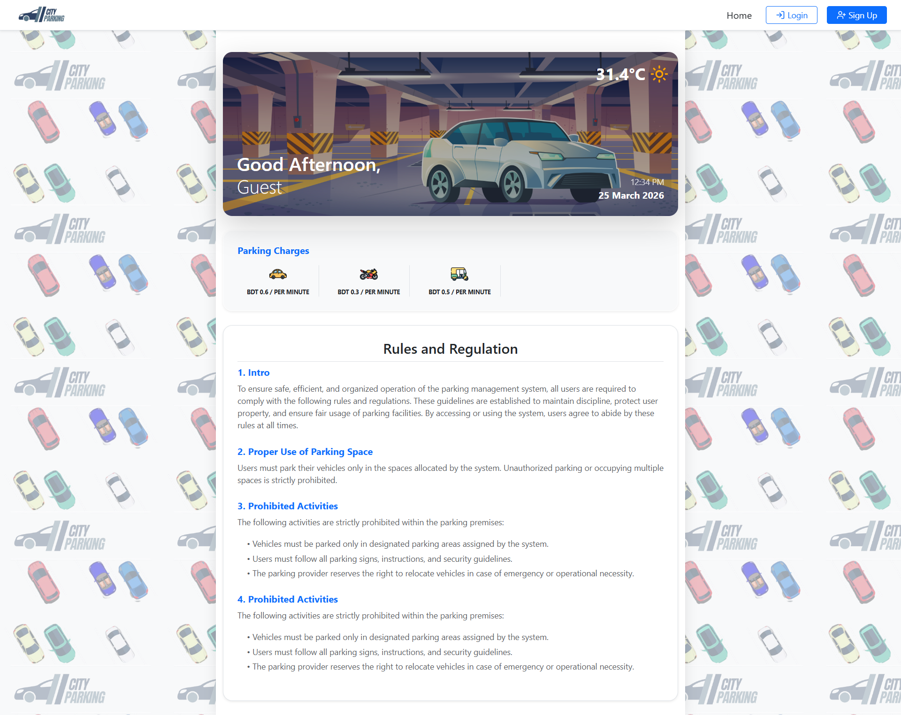
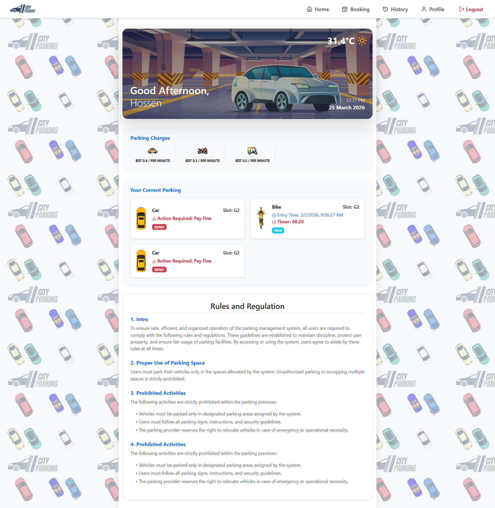
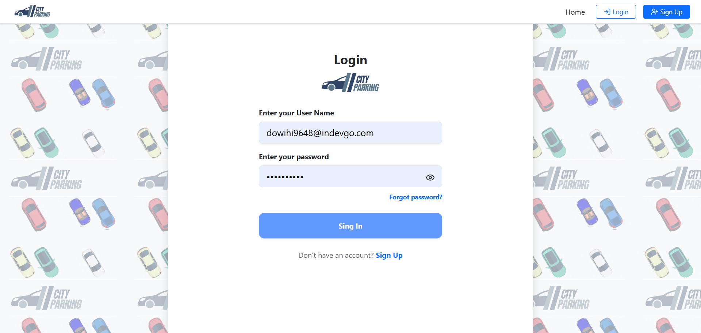
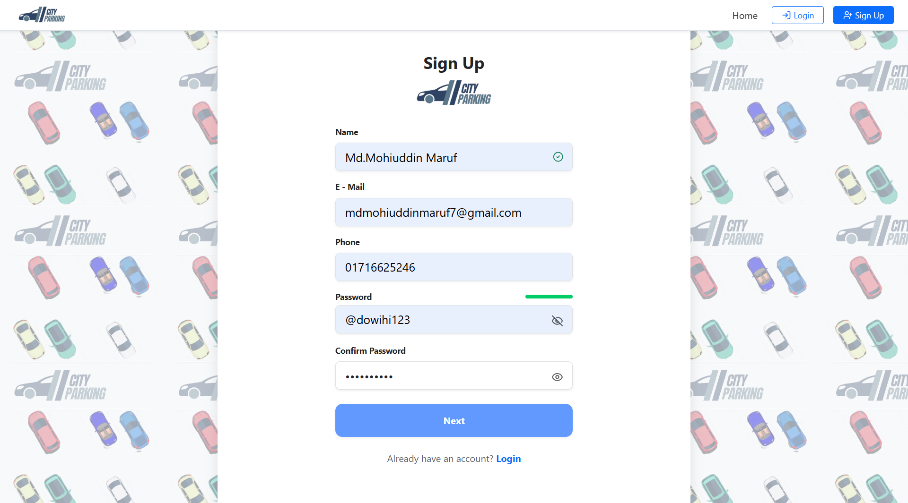
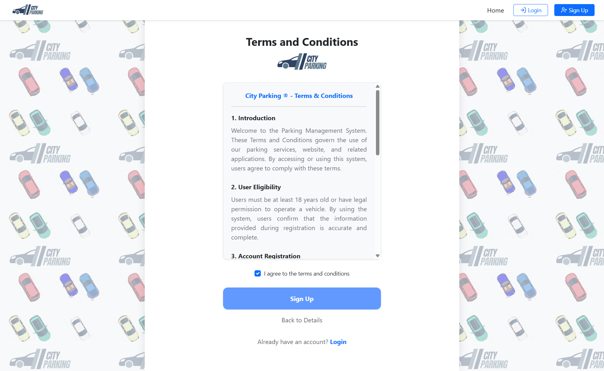
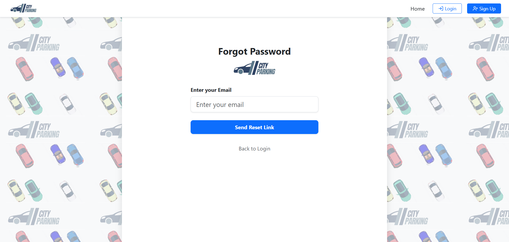
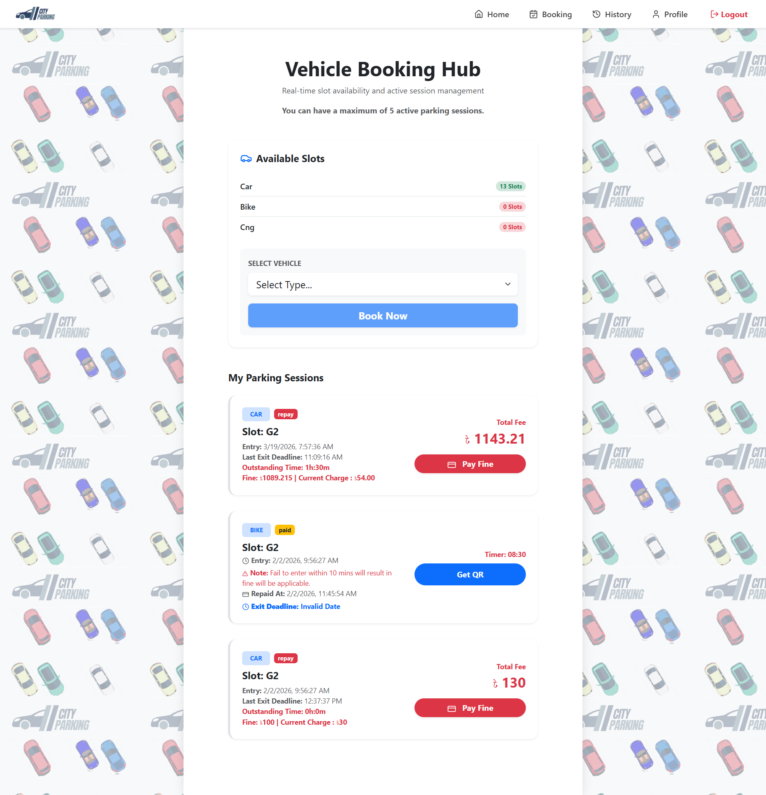
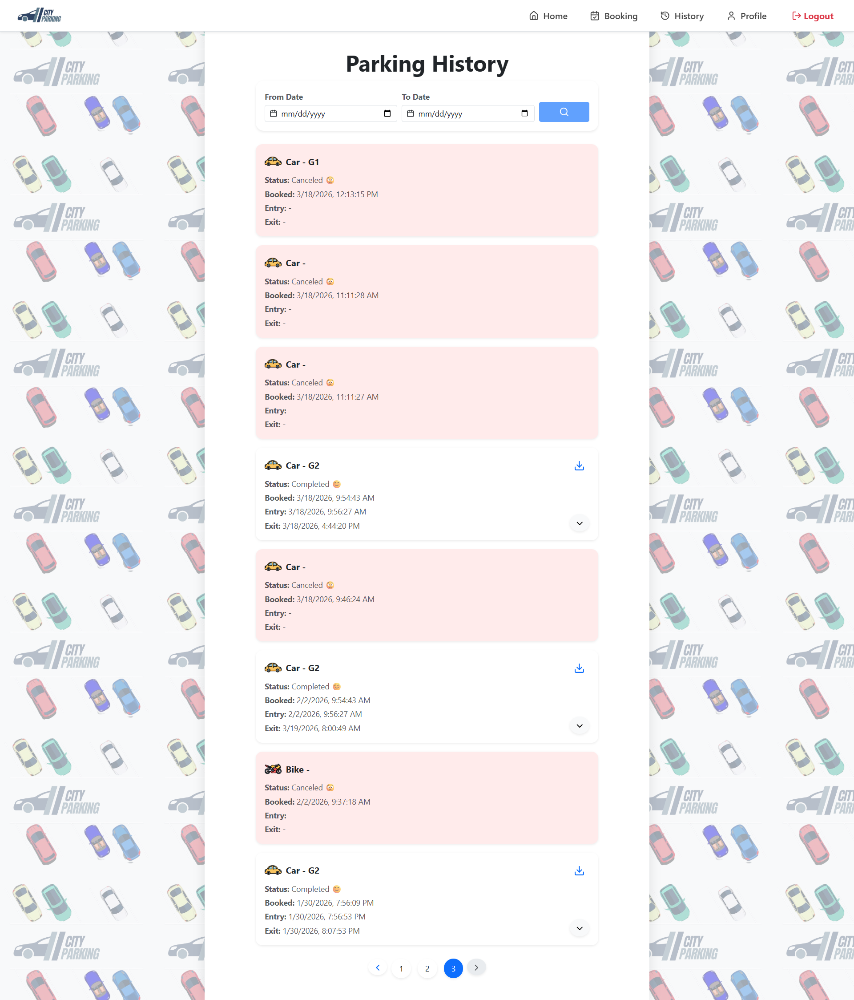

#  City Parking - Smart Parking Management System

A modern, full-stack solution for urban parking management. This platform allows users to book parking slots, track live parking costs, and manage their vehicle history in real-time.

**🌐 Live Demo:** [https://city-parking.onrender.com/](https://city-parking.onrender.com/)

## 🎉 Happy Announcement

We are excited to announce that our **City Parking App APK is now officially launched! 🚀**

### 📥 Download APK
👉 [Click here to download the APK](APK/cityParking.apk)

---

### 📸 App Preview


---

## 📸 Project Gallery

### 🏠 Home Dashboard

Home Page (Guest):

Home Page (Logged User):

*The main dashboard featuring real-time weather integration, personalized greetings, and live parking status.*

### 🛡️ Secure Authentication & Verification

Login Page:

Signup Page Step 1:

Signup Page Step 2:

Forgot Password:


### 📅 Booking, History & Profile

Booking Page:

History Page:

Profile Page:


---

## 🚀 Key Features

* **🔐 Robust Authentication:** Secure Login/Signup powered by Firebase Auth with a custom Global Email Verification Blocker to ensure only verified users access features.
* **⏱️ Live Cost Engine:** Real-time calculation of parking charges based on vehicle type (Car, Bike, Truck, etc.) and duration, updated every second via a custom React hook.
* **📡 Real-time Synchronization:** Integrated with Socket.io to reflect database changes (slot availability/status updates) instantly without page refreshes.
* **📱 Fully Responsive:** Optimized for mobile, tablet, and desktop with a custom-built responsive Navbar and Bootstrap-powered UI.
* **☁️ Weather Integration:** Uses Open-Meteo API to provide live weather updates for the parking location.
* **📜 Rules & Regulations:** Dynamic display of parking guidelines fetched from the backend.

---

## 🛠️ Tech Stack

### Frontend:

* React.js (Hooks, Context API for State Management)
* React Router Dom (Client-side Routing)
* Bootstrap 5 (Layout & Responsiveness)
* Lucide React (Iconography)
* React Toastify (User Notifications)

### Backend & Database:

* Node.js & Express.js (RESTful API)
* MongoDB (Database for History & Rates)
* Firebase Auth (Identity Management)
* Socket.io (WebSockets for real-time updates)

### Deployment:

* Frontend & Backend: Render
* Database: MongoDB Atlas

---

## 🔧 Installation & Setup

### 1. Clone the repository:

```bash
git clone https://github.com/maruf119459/smart-parking-frontend.git
cd smart-parking-frontend
```

### 2. Install dependencies:

```bash
npm install
```

### 3. Create .env file:

```bash
echo REACT_APP_FIREBASE_API_KEY=your_api_key > .env
echo REACT_APP_FIREBASE_AUTH_DOMAIN=your_auth_domain >> .env
echo REACT_APP_BACKEND_URL=your_backend_url >> .env
```

### 4. Run the app:

```bash
npm start
```

---

## 🛡️ License

Distributed under the MIT License. See LICENSE for more information.

---

## 👨‍💻 Developers

Developed with ❤️ by  [Md. Mohiuddin Maruf](https://github.com/maruf119459) & [Abrarul Haque](https://github.com/Abrarul-Haque1303) 
